# GeomHwein - 온라인 교육 플랫폼

## 📌 프로젝트 소개
GeomHwein은 온라인 교육 플랫폼으로, 학습자와 교육자를 연결하여 효과적인 온라인 학습 경험을 제공한다. 과제 관리, 학습 콘텐츠 제공, 커뮤니티 기능 등을 통해 종합적인 교육 관리 시스템을 구현했다.

## 🛠 사용 기술
- **Backend**: Java, Spring Boot
- **Build Tool**: Gradle
- **Database**: MySQL
- **Security**: Spring Security
- **Frontend**: HTML, CSS, JavaScript, jQuery
- **Version Control**: Git

## 🖥 주요 기능

### 1. 메인 페이지
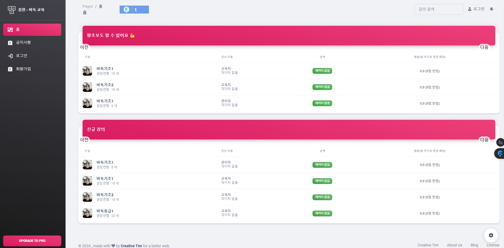
- 직관적인 UI/UX 설계
- 추천 강좌 및 최신 콘텐츠 표시
- 사용자 맞춤형 콘텐츠 추천

### 2. 로그인/회원가입
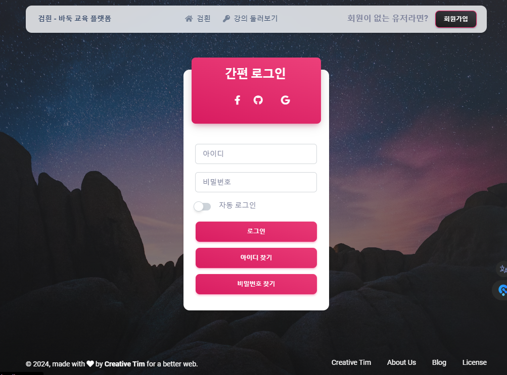
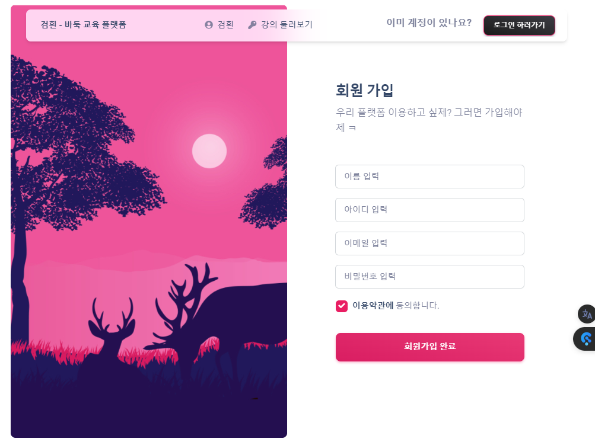
- 안전한 사용자 인증 시스템
- 역할 기반 접근 제어

### 3. 사이드바 네비게이션
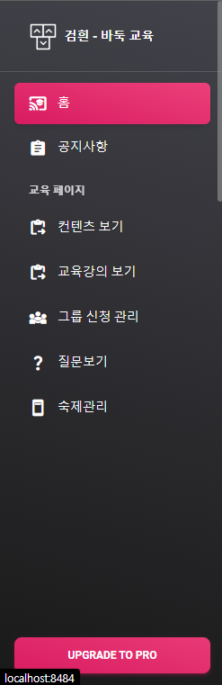
- 편리한 메뉴 접근성
- 사용자 역할별 맞춤 메뉴
- 반응형 디자인

### 4. 학생 기능
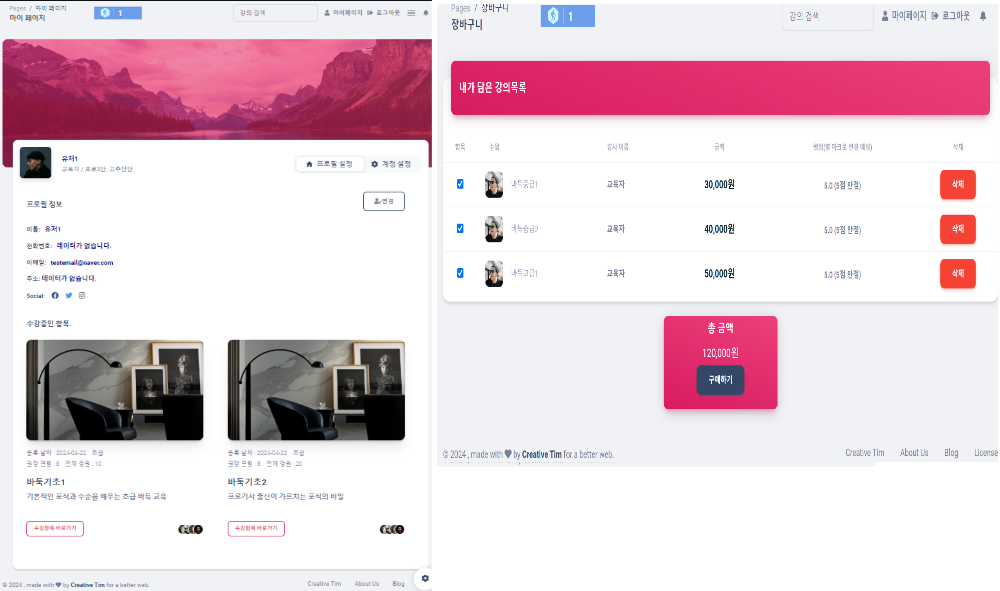
- 개인 학습 현황 관리
- 수강 중인 강좌 확인
- 성적 및 진도 확인

### 5. 커뮤니티 활동
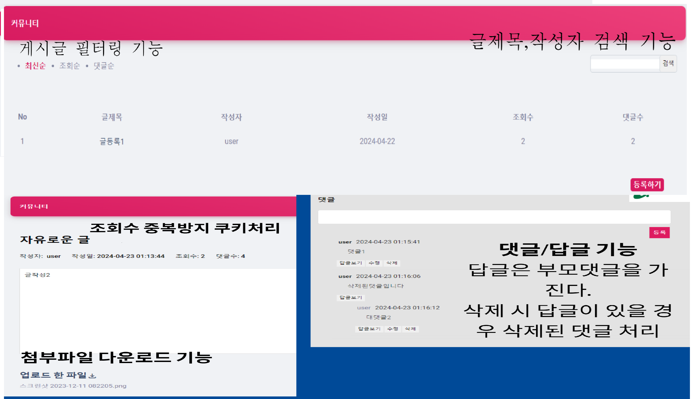
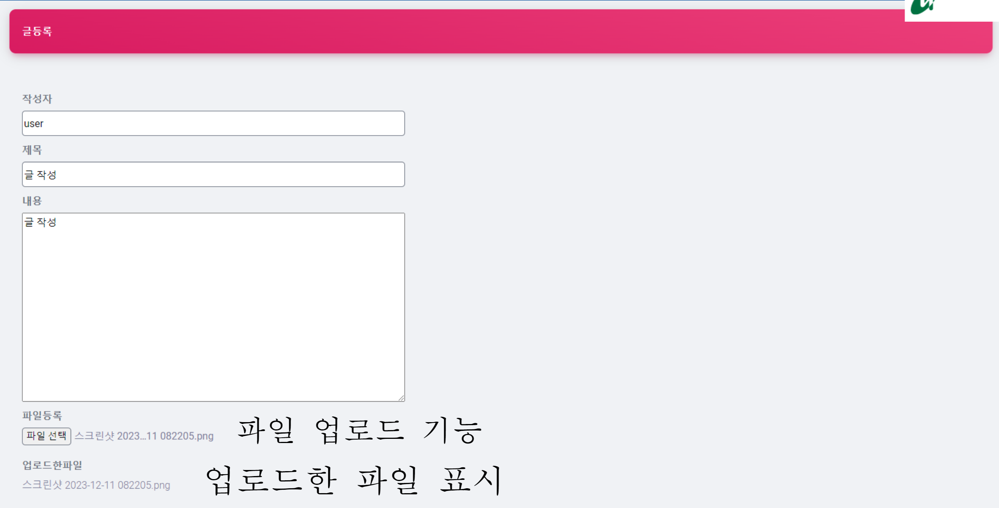
- 학습 커뮤니티 참여
- 질문과 답변
- 학습 자료 공유

### 6. 그룹 스터디
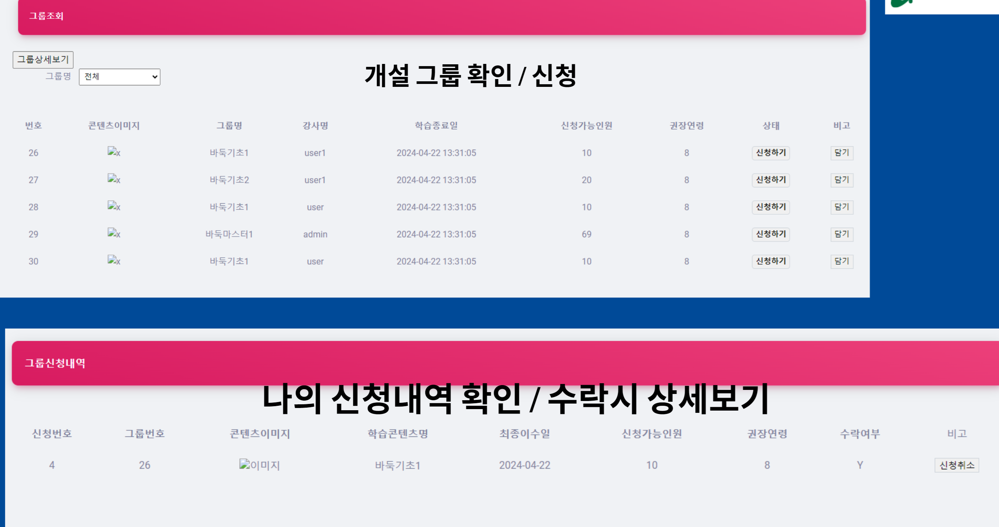
- 스터디 그룹 생성 및 참여
- 그룹별 학습 진행
- 협업 학습 지원

### 7. 질문 시스템
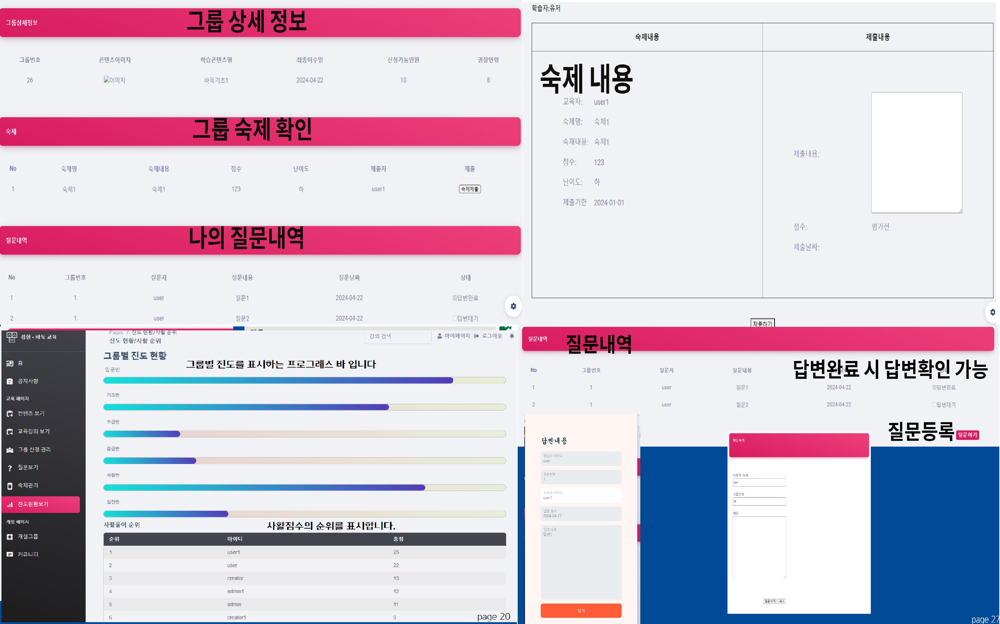
- 실시간 질문 등록
- 상세한 질문 작성
- 답변 추적 관리

### 8. 교육자 기능
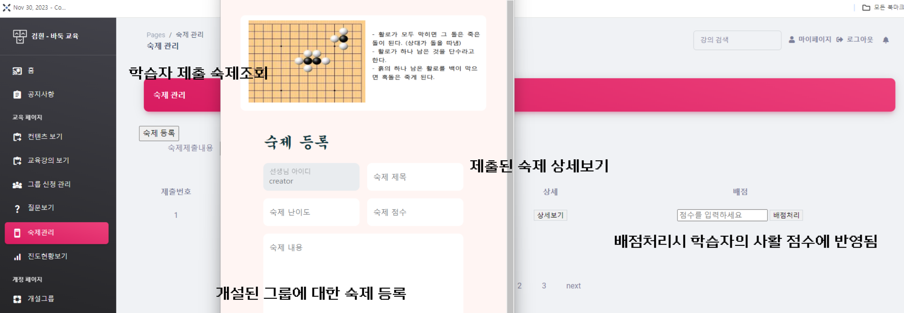
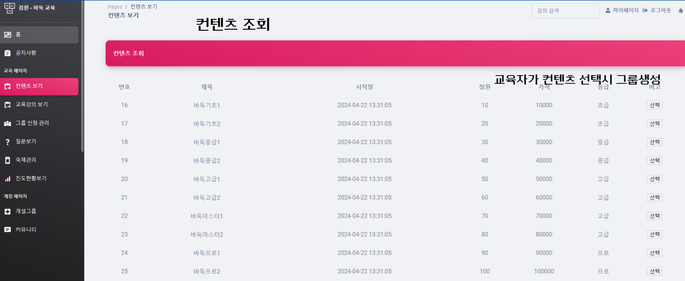
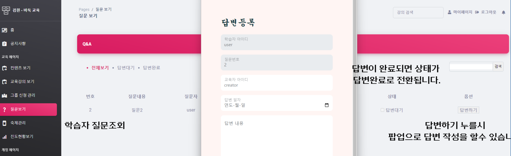
- 과제 출제 및 관리
- 교육 콘텐츠 등록
- 학생 질문 관리
- 평가 및 피드백

## 💡 주요 구현 사항

### 1. 사용자 관리 시스템
- 회원가입 및 로그인
- 사용자 권한 관리
- 프로필 관리

### 2. 교육 콘텐츠 관리
- 강좌 등록 및 관리
- 학습 자료 업로드
- 콘텐츠 카테고리화

### 3. 학습 관리 시스템
- 과제 출제 및 제출
- 진도 관리
- 성적 평가

### 4. 커뮤니티 기능
- 질문/답변 게시판
- 학습 그룹 생성
- 실시간 토론

### 5. 관리자 기능
- 사용자 관리
- 콘텐츠 승인
- 시스템 모니터링

## 🌟 프로젝트 특징
1. **확장 가능한 아키텍처**
   - MVC 패턴 적용
   - 모듈화된 코드 구조
   - RESTful API 설계

2. **보안 강화**
   - Spring Security 활용

3. **사용자 경험 최적화**
   - 반응형 웹 디자인
   - 직관적인 UI/UX
   - 빠른 페이지 로딩

## 📊 ERD
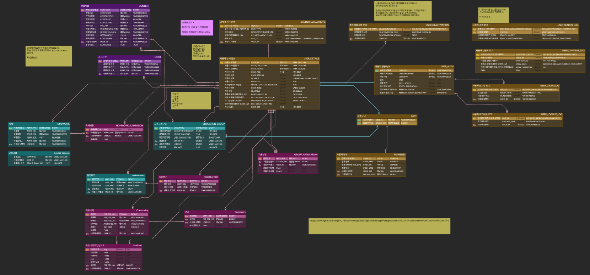


### 주요 컴포넌트
1. **프론트엔드 서비스**
   - 반응형 웹 디자인

2. **백엔드 API 서버**
   - RESTful API 제공
   - 비즈니스 로직 처리

3. **워커 서버**
   - 비동기 작업 처리
   - 파일 처리
   - 알림 서비스

4. **데이터 저장소**
   - MySQL
   - S3: 파일 스토리지


### 디렉토리 구조
```
src/
├── main/
│   ├── java/
│   │   └── com/geomhwein/go/
│   │       ├── admin/         # 관리자 기능
│   │       ├── command/       # VO 클래스
│   │       ├── controller/    # API 엔드포인트
│   │       ├── creator/       # 콘텐츠 제작
│   │       ├── security/      # 보안 설정
│   │       ├── user/          # 사용자 관리
│   │       └── util/          # 유틸리티
│   └── resources/
└── test/                      # 테스트 코드
```

## 🚀 향후 계획
1. 실시간 화상 강의 기능 추가
2. AI 기반 학습 추천 시스템 도입
3. 다국어 지원 확대

## 👥 팀 구성
- Backend Developer

## 📚 사용 라이브러리 및 리소스

### Backend 라이브러리
- Spring Boot 2.7.x (Apache 2.0 License)
- Spring Security (Apache 2.0 License)
- Spring Data JPA (Apache 2.0 License)
- Lombok 
- MySQL Connector (GPL 2.0 License)
- Gradle (Apache 2.0 License)

### Frontend 라이브러리
- jQuery 3.6.0 
- Bootstrap 5.0 
- Font Awesome 5.15 (Free Version - CC BY 4.0 License)
- SweetAlert2 
- Summernote Editor 

### UI/UX 리소스
- Google Fonts (Open Font License)
- Material Icons (Apache 2.0 License)
- Bootstrap Icons (MIT License)
- Unsplash Images (Unsplash License)

### 개발 도구
- IntelliJ IDEA Community Edition (Apache 2.0 License)
- Visual Studio Code (MIT License)
- Git (GNU General Public License version 2.0)

모든 라이브러리와 리소스는 각각의 라이선스 정책을 준수하여 사용되었다. 자세한 라이선스 정보는 각 프로젝트의 공식 웹사이트에서 확인할 수 있다. 

## 🔧 기술 스택 상세

### Backend 아키텍처
- **Spring Boot 기반 RESTful API**
  - Spring MVC를 활용한 컨트롤러 구현
  - Spring Security를 이용한 JWT 기반 인증

### 데이터베이스 설계
- **MySQL 8.0**
  - 정규화된 테이블 설계

### Frontend 기술
- **반응형 웹 디자인**
  - Bootstrap Grid System
  - CSS Flexbox/Grid
  - Media Query 최적화
- **동적 UI 구현**
  - jQuery AJAX 비동기 통신
  - SweetAlert2 알림 시스템
  - 동적 폼 검증


### 보안 구현
- **Spring Security**
  - Role 기반 접근 제어
  - Password Encode
  - CSRF 방어
- **파일 업로드 보안**
  - 파일 확장자 검증
  - 용량 제한 설정


### 개발 환경 및 도구
- **버전 관리**
  - Git Flow 전략
